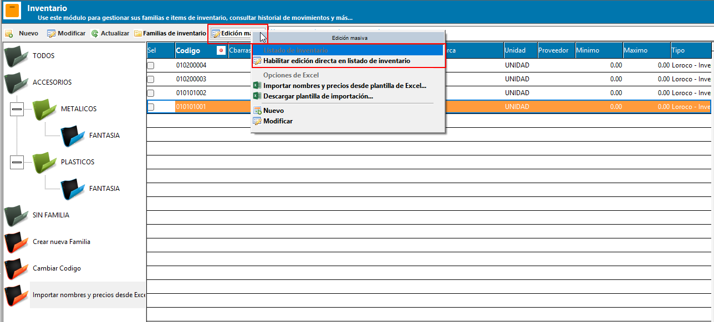
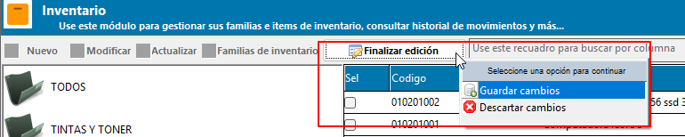
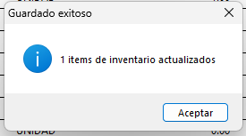

# 📝 **Edición del listado de inventario**

El **modo de edición directa** permite modificar o corregir varios datos de inventario desde la misma cuadrícula, sin necesidad de abrir la ficha de cada producto de forma individual. Es la vía más rápida para poner al día nombres, precios o existencias mínimas y máximas en un grupo de productos.

!!! abstract "Parte del módulo de Inventario"
    Esta página forma parte de la [Gestión de Inventario](GestionInventario.md). Para dar de alta un producto nuevo o completar toda su información (precios, impuestos, ubicación, historial), use la [Ficha de Inventario](FichaInventario.md).

## 📋 **1. El listado de inventario**

Al abrir la gestión de inventario, junto al [árbol de familias](FamiliaInventario.md) se muestra la cuadrícula con todos los productos y materiales registrados, con la información más relevante para la operación diaria:

| Columna | Descripción |
| ------- | ----------- |
| Código | Código único del ítem de inventario. |
| Código de barras | Código de barras asociado al ítem. |
| Nombre | Nombre o descripción del ítem. |
| Modelo / Marca | Datos de referencia del producto. |
| Unidad | Nombre de la unidad de medida. |
| Proveedor | Nombre del proveedor principal. |
| Mínimo / Máximo | Existencias mínima y máxima configuradas. |
| Tipo | Descripción del tipo o clasificación del ítem. |
| Departamento | Departamento contable asociado. |
| Precio de referencia | Precio de referencia del ítem. |
| Código de familia / Familia | Código y nombre de la familia a la que pertenece el ítem. |
| Precio de venta 1, 2 y 3 | Las tres listas de precio de venta configuradas para el ítem. |

{ align=center }

!!! info "Datos disponibles en la ficha individual"
    La fecha de última actualización y las casillas de IVA, Retención de IVA y Retención de Renta no forman parte de este listado; se consultan y modifican desde la [Ficha de Inventario](FichaInventario.md).

## ✏️ **2. Activar el modo de edición**

Para editar directamente sobre la cuadrícula:

1. En la barra de herramientas superior del listado, presione el botón **Editar listado de inventario**.
2. La cuadrícula habilita la edición únicamente sobre las columnas permitidas (ver [sección 3](#3-columnas-editables)); el resto de columnas permanece bloqueado.
3. Modifique los valores necesarios directamente sobre las celdas.
4. Al terminar, presione el mismo botón —ahora identificado como **Finalizar edición**— y elija una de las dos opciones del menú:
    - **Guardar cambios**: aplica todas las modificaciones realizadas.
    - **Descartar cambios**: solicita confirmación y, si se acepta, revierte el listado a su estado original sin guardar nada.

{ align=center }

{ align=center }

!!! warning "Solo un elemento del árbol a la vez"
    Mientras el modo de edición esté activo no es posible seleccionar otro nodo del árbol de familias. Si lo intenta, el sistema muestra el aviso *"Finalice el proceso actual antes de continuar seleccionando otro elemento"*. Debe guardar o descartar los cambios pendientes antes de continuar navegando.

## 🔓 **3. Columnas editables**

Desde el modo de edición se pueden modificar directamente:

- Código de barras
- Nombre
- Modelo
- Marca
- Existencia mínima
- Existencia máxima
- Precios de venta 1, 2 y 3

Las columnas **Selección**, **Unidad**, **Código de familia** y **Proveedor** permanecen de solo lectura desde este listado. Para modificarlas debe abrirse la [Ficha de Inventario](FichaInventario.md) del producto.

!!! warning "El nombre no puede quedar vacío"
    Si al guardar se detecta un ítem con el nombre en blanco, el sistema bloquea el guardado completo y señala el código o la línea afectada, para que sea corregida antes de continuar.

## 🕘 **4. Registro en bitácora**

Cada campo modificado desde el modo de edición queda registrado individualmente en la bitácora del sistema, indicando el ítem afectado, el campo editado, el valor anterior y el nuevo valor. Esto permite dar seguimiento completo a los cambios realizados desde esta vista.

Al finalizar la edición:

- Si hubo cambios y se guardan correctamente, el sistema confirma la cantidad de ítems actualizados.
- Si no se modificó ningún dato, se informa que no hay cambios que guardar.
- Si se descartan los cambios, también queda registrada la cancelación en la bitácora.

{ align=center }

## 📌 **5. Buenas prácticas**

- Filtre primero por familia desde el árbol y trabaje por bloques: es más fácil revisar un grupo homogéneo de productos que el listado completo.
- Revise cuidadosamente los valores antes de guardar; los cambios se aplican de una sola vez a todos los ítems editados.
- Use **Descartar cambios** si nota un error grave antes de guardar, en lugar de intentar corregirlo celda por celda.
- Consulte la bitácora periódicamente para auditar los cambios realizados desde este modo de edición masiva.

## 🔗 **6. Páginas relacionadas**

<iframe width="560" height="315" src="https://www.youtube.com/embed/PPzVawNkLgY?si=6hhxLhlVpxhIwdJG" title="YouTube video player" frameborder="0" allow="accelerometer; autoplay; clipboard-write; encrypted-media; gyroscope; picture-in-picture; web-share" referrerpolicy="strict-origin-when-cross-origin" allowfullscreen></iframe>

- [Gestión de Inventario](GestionInventario.md)
- [Ficha de Inventario](FichaInventario.md)
- [Gestión de familias de inventario](FamiliaInventario.md)
