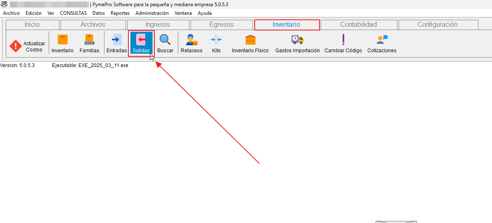
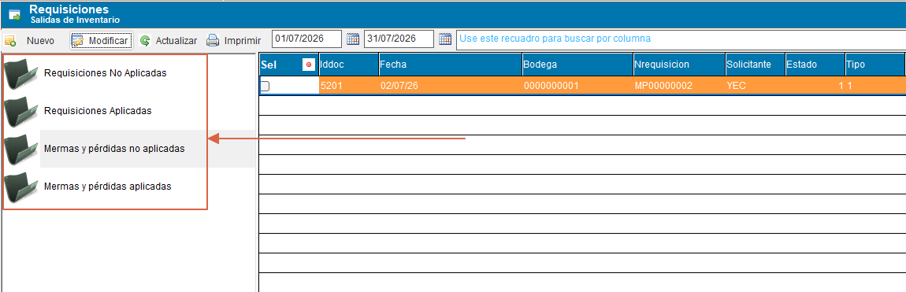
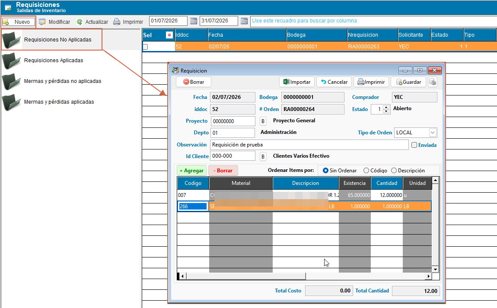
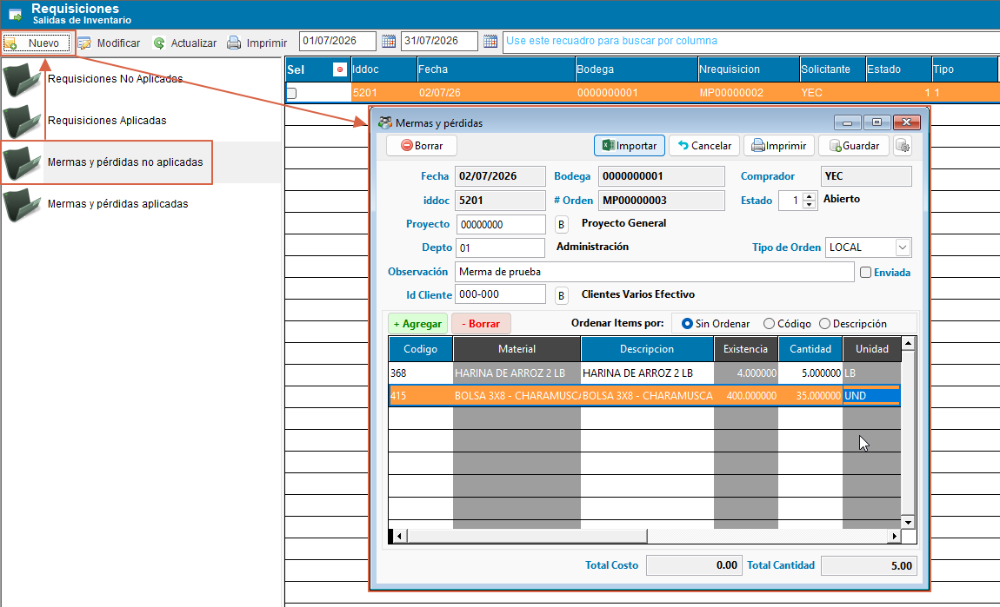

# 📄 Gestión de requisiciones, mermas y pérdidas

Este documento explica cómo registrar y gestionar las requisiciones y las salidas de inventario por mermas o pérdidas. Ambas funciones se manejan desde un flujo similar y ayudan a mantener el inventario actualizado cuando se entrega material a uso interno o cuando un producto sale del sistema por deterioro o daño.

## ☝️ **1. ¿Cuándo usar cada opción?**

- Requisiciones: se usan para solicitar productos o materiales para uso interno, producción o un proyecto específico.
- Mermas y pérdidas: se usan para dar de baja productos que salen del inventario por desperdicio, sobrante, deterioro, obsolescencia, daño u otras causas no relacionadas con una venta.

## 📂 **2. Acceso a requisiciones, mermas y pérdidas**

Para abrir la función:

1. En la barra de herramientas superior, haga clic en el panel "Inventario".
2. Abra la opción de "Salidas".
3. Revise el árbol de navegación para ver los documentos en estado no aplicadas o aplicadas.

{ align=center }

## 🔎 **3. Búsqueda de productos por código de barras**

Tanto en requisiciones como en mermas y pérdidas, el sistema permite alternar la forma en que se busca un producto en el detalle del documento: por su **código de inventario** o por su **código de barras**.

Para activar o desactivar la búsqueda por código de barras:

1. Dentro del formulario de requisición o merma, dé clic derecho sobre la sección de detalle para abrir el menú contextual.
2. Seleccione la opción **"Búsqueda de inventario por código de barra"**. Un ícono de check indica si la opción está activa o no.
3. Un rótulo en la parte superior del detalle le confirma en todo momento el modo de búsqueda activo: *"La búsqueda de inventario se realiza por medio de código"* (o *"...de código de barras"* cuando la opción está activada).

Con la búsqueda por código de barras activada, puede:

- **Escribir o escanear directamente** el código de barras en la línea de detalle para que el sistema localice el producto.
- **Buscar desde el listado desplegable**: al abrir el buscador de productos del detalle, también puede escribir o escanear el código de barras para filtrar y seleccionar el producto, igual que si buscara por código de inventario.

!!! tip "Lector de código de barras"
    Esta opción es especialmente útil si cuenta con un lector de código de barras físico, ya que agiliza la captura de productos evitando digitar el código de inventario manualmente.

---

## 📊 **4. Entender el estado de los documentos**

El árbol de navegación suele organizar los documentos por tipo y estado:

- Requisiciones no aplicadas: creadas pero aún no afectadas al inventario.
- Requisiciones aplicadas: ya procesadas y registradas en inventario.
- Mermas y pérdidas no aplicadas: guardadas pero pendientes de procesamiento.
- Mermas y pérdidas aplicadas: ya registradas como salida del inventario.

{ align=center }

## 📝 **5. Crear una requisición**

Para registrar una requisición:

1. Seleccione la sección de requisiciones no aplicadas.
2. De click en el botón para "Nuevo" para crear una nueva requisición.
3. Complete los datos del encabezado, como fecha, bodega, solicitante y observaciones.
4. Agregue los productos que necesita en la sección de detalle.
5. Guarde el documento.

{ align=center }

### Consejos prácticos

- Indique claramente el motivo de la solicitud.
- Revise la bodega y la cantidad antes de guardar.
- Si cuenta con lector de código de barras, puede activar la búsqueda por código de barras (ver [sección 3](#3-busqueda-de-productos-por-codigo-de-barras)) para agilizar la captura de productos.

## 📝 **6. Registrar una merma o pérdida**

Para registrar una salida por merma o pérdida:

1. Seleccione la opción de mermas y pérdidas no aplicadas.
2. Cree un nuevo documento.
3. Complete los datos del encabezado y la causa de la salida.
4. Agregue los productos a dar de baja.
5. Guarde el documento.

!!! tip "Datos útiles en una merma o pérdida"
    En este tipo de documento es clave señalar la causa de la salida y comprobar que el producto realmente salga del inventario. La observación y la bodega deben quedar claramente registradas.

{ align=center }

### Información útil en el texto detallado en la observación

Incluya datos claros sobre la causa en la observación, como:

- Producto dañado.
- Error de manejo.
- Pérdida por traslado o almacenamiento.

## 📄 **7. Consultar documentos aplicados**

Para revisar el historial:

1. Acceda al nodo correspondiente en el árbol de navegación.
2. Seleccione la opción de aplicadas.
3. Revise el documento y sus detalles.

Esto permite verificar qué salidas ya fueron procesadas y confirmar el impacto en el inventario.

## 📌 **8. Buenas prácticas**

- Revise la bodega y la cantidad antes de aplicar un documento.
- Use observaciones claras para facilitar la auditoría.
- No deje documentos sin revisar cuando ya estén listos para aplicar.
- Consulte periódicamente los registros aplicados para confirmar que el inventario refleje la operación real.
