# Documentación - Módulo de Planillas

!!! tip " **Módulo de Planillas**"
    ``` mermaid
    graph TD
      A[Índice de contenidos]:::root

      subgraph "Subcategorías"
        B[1. Interfaz principal de planillas]
        C[2. Funciones y características generales]
        D[3. Cuadratura y cálculo de ISSS]
        E[4. Planilla quincena 25]
        F[5. Exportación a CSV de pago]
      end

      A --> B
      A --> C
      A --> D
      A --> E
      A --> F

    click B "#1-interfaz-principal-de-planillas" "Ir a Interfaz principal de planillas"
    click C "#2-funciones-y-caracteristicas-generales" "Ir a funciones generales"
    click D "#3-cuadratura-y-calculo-de-isss" "Ir a cálculo de ISSS"
    click E "#4-planilla-quincena-25" "Ir a planilla quincena 25"
    click F "#5-exportacion-a-csv-de-pago" "Ir a Exportación a CSV de pago"
    ```
---

## 1. Interfaz principal de planillas

!!! abstract "Interfaz principal de planillas"

    El módulo de planillas permite gestionar todos los aspectos relacionados con el pago de sus empleados. Desde este menú principal se puede acceder a las diferentes funcionalidades del módulo.

    **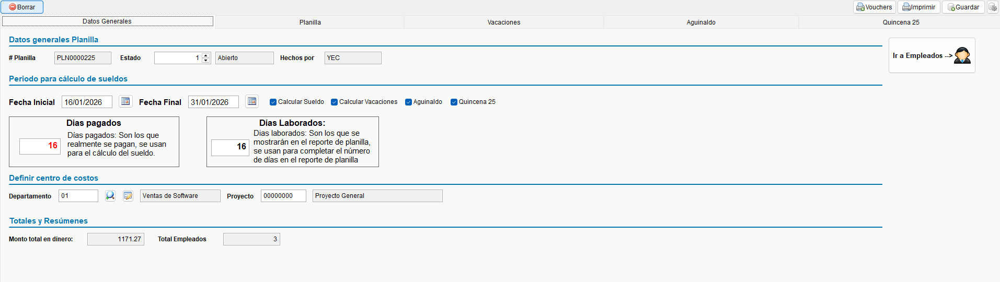{ align=left }**

---

## 2. Funciones y características generales

!!! abstract "Características del módulo"

    El módulo de planillas de ContaPortable es una herramienta integral diseñada para facilitar la administración y el cálculo de la nómina de la empresa. Entre sus principales funciones se incluyen:

    - **Gestión de empleados:** Creación y mantenimiento de la ficha del empleado, control de salarios, cargos, departamentos, y porcentajes de cotización (ISSS, AFP, INPEP).
    - **Generación de planillas:** Creación de planillas quincenales, mensuales, vacacionales, o aguinaldos.
    - **Cálculo automático de retenciones:** Determinación automática de los descuentos de ley (ISSS, AFP, Impuesto sobre la Renta) basándose en las tablas y techos vigentes.
    - **Ingresos y deducciones:** Registro de horas extras, bonificaciones, viáticos, préstamos internos, y otras deducciones personalizadas.
    - **Emisión de boletas de pago:** Generación e impresión de boletas o recibos de pago para los empleados.
    - **Reportes de nómina:** Emisión de resúmenes de planilla, listados para integración contable (F14) e importación de registros.

    <p style="text-align:center">
    *Interfaz principal de planillas*
    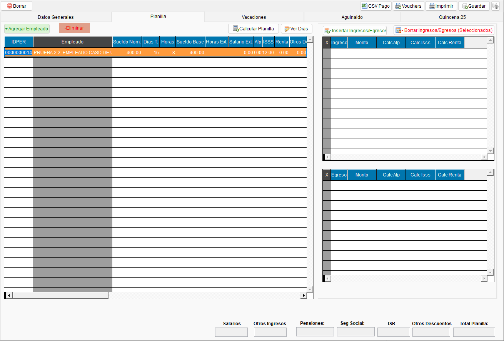 <br><br>
    *Gestión de empleados*
    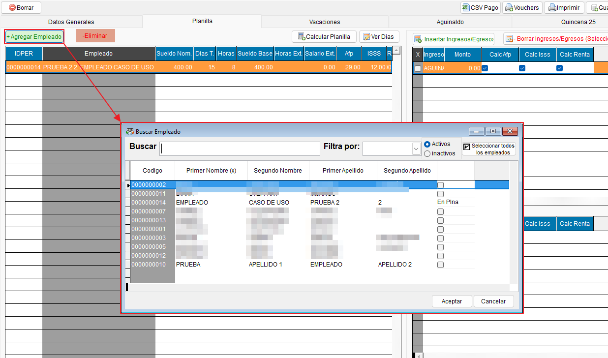 <br>
    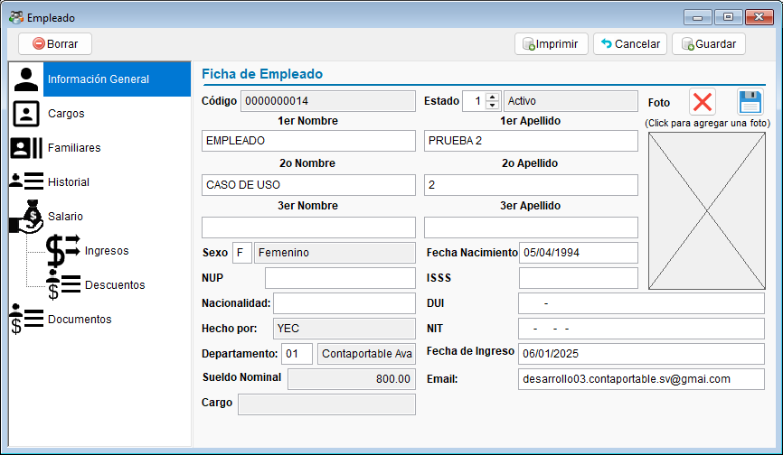 <br><br>
    *Registro de ingresos y deducciones*
    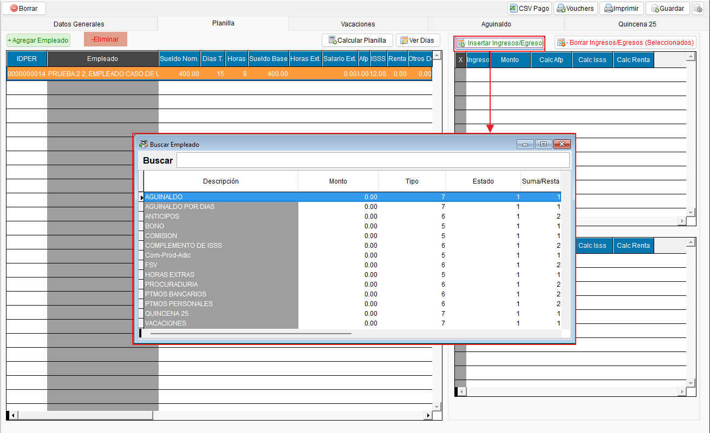 <br><br>
    *Emisión de boletas de pago*
    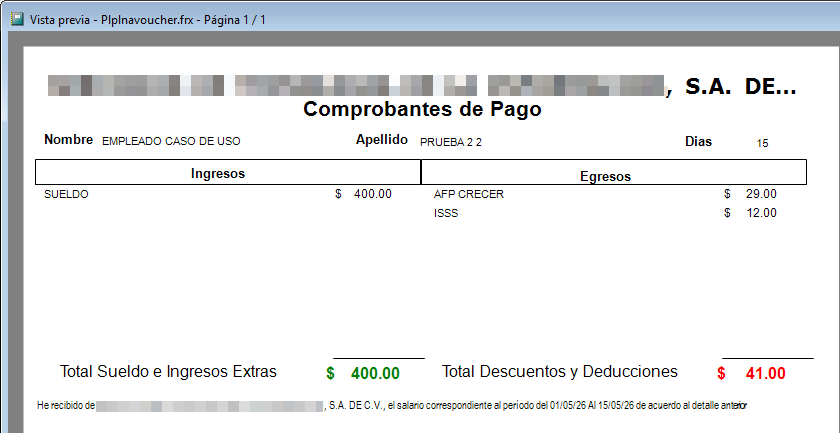 <br><br>
    *Reportes de nómina*
    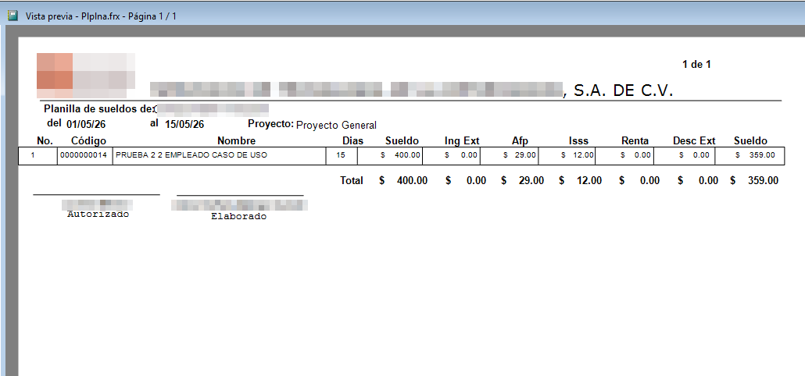 <br>
    </p>
---

## 3. Cuadratura y cálculo de ISSS

!!! abstract "Distribución del cálculo de deducciones para el ISSS"

    El sistema incluye un mecanismo para garantizar la **cuadratura de la retención del ISSS**, asegurando que los descuentos se apliquen correctamente a lo largo del mes y respetando el techo máximo mensual establecido por la ley.

    El cálculo y distribución se realiza de la siguiente manera al procesar planillas múltiples en un mismo mes (ej. Quincenales):

    - **Primera planilla (o inicio de mes):**
      Para evitar deducir la mayor parte (o la totalidad) del ISSS mensual en el primer pago a empleados con salarios altos, el sistema aplica un **techo proporcional**. Por ejemplo, si el periodo abarca 15 días, el límite máximo a descontar será proporcional a esos 15 días.
      *(Si el cálculo teórico supera este techo, se aplica el techo proporcional y el sistema registra la diferencia pendiente).*

    - **Segunda planilla (y planillas posteriores del mismo mes):**
      El sistema verifica el acumulado de ingresos y de ISSS retenido en las planillas previas del mismo mes. Se calcula el ISSS correcto basado en el total de ingresos del mes y se **ajusta al monto disponible real**.
      Esto permite que el sistema realice un ajuste automático (retroactivo) en las siguientes planillas, descontando la diferencia pendiente si la planilla anterior quedó por debajo del límite debido a la aplicación del techo proporcional.

    De esta manera, el descuento total del ISSS a fin de mes siempre cuadra con exactitud sobre el total de ingresos gravados, sin afectar desproporcionadamente la liquidez del empleado en la primera planilla.

    **Nota**: Se mostrará un mensaje descriptivo sobre los ajustes aplicados en cuanto a las deducciones de ISSS, para que el usuario pueda comprender como se realiza el ajuste.

    <p style="text-align:center">
    *Mensaje explicativo sobre ajuste en el cálculo de deducción ISSS*
    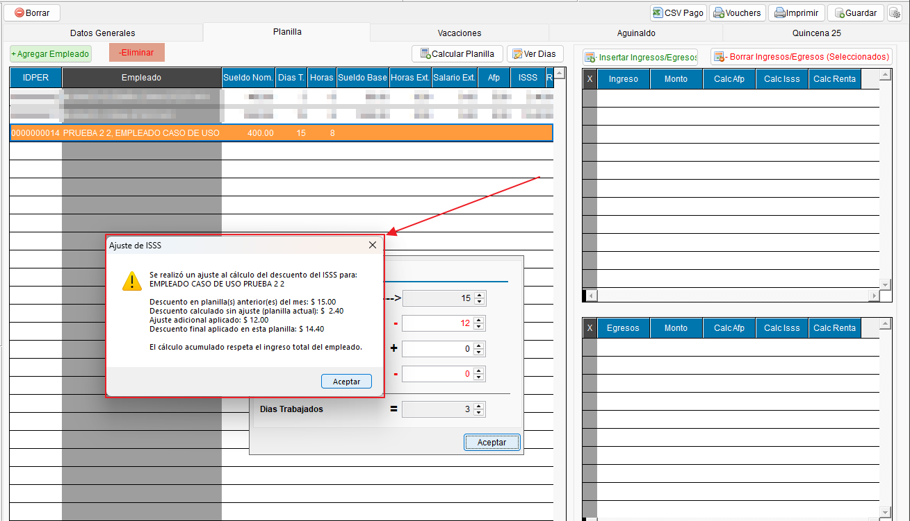
    </p>

---

## 4. Planilla Quincena 25

!!! abstract "Planilla Quincena 25"

    Esta opción permite acceder al módulo de **Planilla Quincena 25**, donde se podrá gestionar y calcular la planilla correspondiente a la segunda quincena del mes.

    Para más información, consulte la documentación detallada: 
    
    - **[Ir a la documentación de Planilla Quincena 25 :material-arrow-right-bold-box-outline:](planillas_Q25.md){ .md-button }**

---

## 5. Exportación a CSV de Pago

!!! abstract "Generación de CSV de Pago"

    Para facilitar el proceso de pago de salarios por medio de plataformas bancarias, el módulo de planillas incorpora un **botón para generar un archivo CSV de pago**.
    
    Esta funcionalidad exporta los montos netos (después de las deducciones correspondientes) a pagar junto con la información bancaria de cada empleado (número de cuenta), en un formato estandarizado `.csv` que puede ser cargado directamente en el portal de la institución financiera para realizar las transferencias masivas.

    **Nota importante**: De momento solamente es posible generar el CSV de pago con una estructura para subir a la plataforma del Banco Agrícola.

    <p style="text-align:center">
    *Ubicación del botón de generación de CSV de pago*
    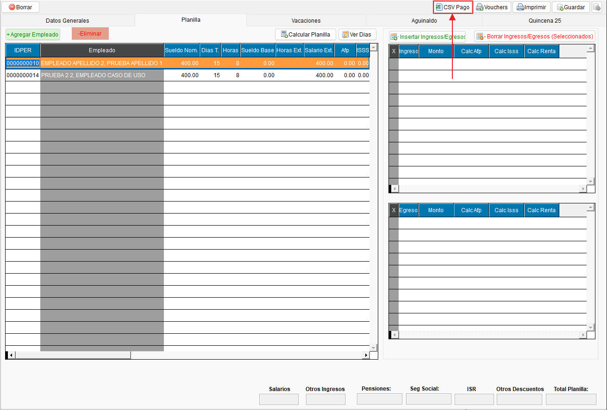{ align=center }

    *Configuración de las columnas del CSV de pago*
    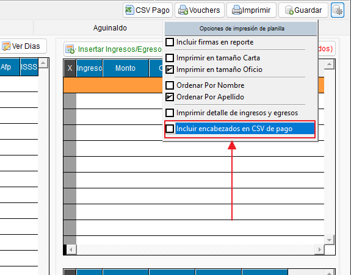{ align=center }

    *Resultado de la generación del CSV de pago*
    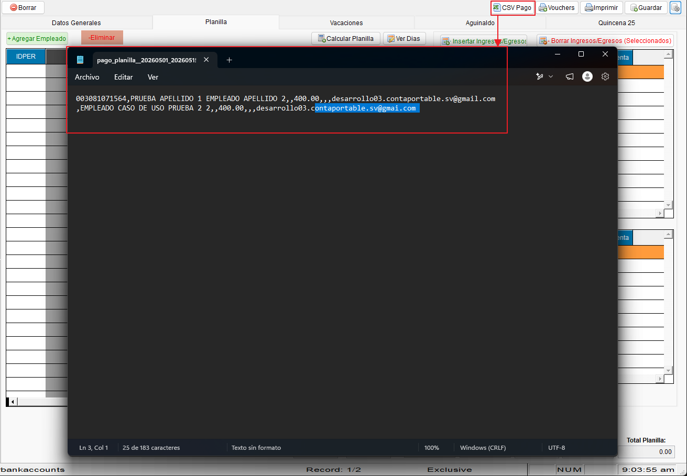{ align=center }
    </p>

---
