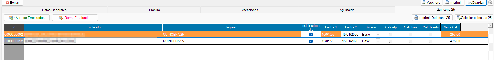
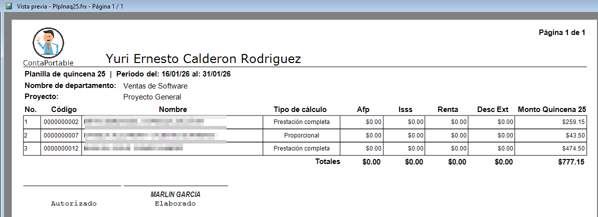

# Documentación - Planilla Quincena 25

!!! tip " **Planillas - Quincena 25**"
    ``` mermaid
    graph TD
      A[Índice de contenidos]:::root

      subgraph "Subcategorías"
        B[1. Menú Principal de Planilla Q25]
        C[2. Botones y Acciones]
        D[3. Reporte de Planilla Q25]
      end

      A --> B
      A --> C
      A --> D

    click B "#1-menu-principal-de-planilla-q25" "Ir a Menú Principal de Planilla Q25"
    click C "#2-botones-y-acciones" "Ir a Botones y Acciones"
    click D "#3-reporte-de-planilla-q25" "Ir a Reporte de Planilla Q25"
    ```
---

## 1. Menú Principal de Planilla Q25

!!! abstract "Menú Principal de Planilla Q25"

    La pantalla principal del módulo de Planilla Quincena 25 (Q25) permite gestionar los empleados y calcular la planilla correspondiente a la segunda quincena del mes.

    **{ align=left }**


---

## 2. Botones y Acciones

!!! abstract "Botones y Acciones"

    El módulo cuenta con varios botones y acciones para gestionar la planilla:

    *   **Agregar Empleado**: Permite añadir un nuevo empleado a la planilla.
    *   **Eliminar Empleado**: Elimina el empleado seleccionado de la planilla.
    *   **Incluir primer día para cálculo proporcional**: Un cheque que al ser marcado, incluye el primer día del período para realizar un cálculo proporcional del salario del empleado.
    *   **Calcular Quincena 25**: Realiza el cálculo de la planilla para todos los empleados listados.
    *   **Imprimir Quincena 25**: Genera el reporte de la planilla Q25, el cual puede ser impreso.

---

## 3. Reporte de Planilla Q25

!!! abstract "Reporte de Planilla Q25"

    Al hacer clic en **Imprimir Quincena 25**, el sistema genera un reporte detallado de la planilla, mostrando los montos calculados para cada empleado.

    **{ align=left }**

---

##
---
