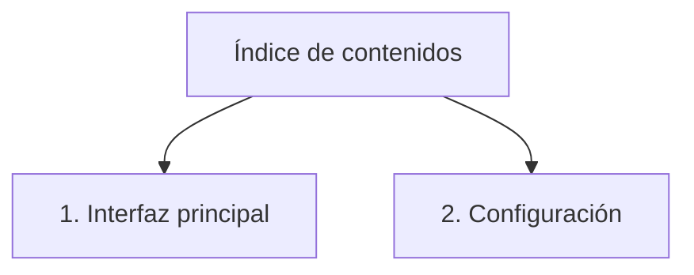

# Lineamientos de Documentación — Proyecto CPDOCS

> Guía de estilo y diseño Markdown para generar documentación consistente en el proyecto ContaPortable.
> Basada en el análisis del corpus existente de documentación bajo `docs/`.

---

## 1. Configuración del Proyecto (MkDocs Material)

El proyecto usa **MkDocs con el tema Material** y las siguientes extensiones activas:

| Extensión | Propósito |
| --------- | --------- |
| `admonition` | Bloques de llamada (!!! info, !!! note, etc.) |
| `pymdownx.details` | Secciones colapsables (???) |
| `pymdownx.superfences` | Bloques de código avanzados + Mermaid |
| `pymdownx.tabbed` | Contenido en pestañas (===) |
| `pymdownx.emoji` | Iconos Material y emojis (twemoji) |
| `pymdownx.keys` | Representación de teclas |
| `pymdownx.highlight` | Resaltado de sintaxis en código |
| `attr_list` | Atributos HTML en elementos (`{ .align=center }`) |
| `md_in_html` | Markdown dentro de bloques HTML |
| `pymdownx.blocks.caption` | Bloques con pie de imagen/texto |
| `tables` | Tablas Markdown estándar |
| `def_list` | Listas de definición |
| `footnotes` | Notas al pie |

**Plugin adicional:** `glightbox` — permite hacer zoom a las imágenes al hacer clic.

---

## 2. Jerarquía de Encabezados

### H1 — Título principal del documento

- **Uno por archivo**, al inicio.
- Puede incluir el nombre del módulo/reporte y una descripción separada por ` — `.
- Se puede anteponer un icono Material o un emoji.

```markdown
# RGDUAL - Documentación, Guia de Instalación y Uso
# Documentación - Módulo de Planillas
# :material-folder-tree: Gestión de Familias de Inventario
# CLI1I — Reporte de Productos Vendidos Agrupados por Familia
```

### H2 — Secciones principales

- **Siempre llevan un emoji** al inicio para identificación visual.
- Separadas entre sí con una línea horizontal `---`.

```markdown
## 📌 Introducción
## 📦 Instalación y requisitos
## ⚙️ Configuración
## 📝 Historial de actualizaciones
## 📚 Uso General
## 🧩 Funcionalidades
## 🚀 Características del reporte
```

### H3 — Subsecciones

- Usados dentro de secciones H2 para detallar subtemas específicos.
- **Siempre llevan emoji** — aparecen en la tabla de contenidos lateral y deben ser identificables visualmente, igual que los H2.
- Elegir el emoji más representativo del contenido de la subsección.

```markdown
### 🔒 Comportamiento con el privilegio activado
### 🔓 Comportamiento con el privilegio desactivado
### 📊 Límite máximo de descuento
### 🔑 Configuración de contraseña por primera vez
### 🧪 Pruebas de configuración
### 🧪 Pruebas de bloqueo de descuentos
```

**Catálogo de emojis para H3** (además de los usados en H2):

| Emoji | Uso en H3 |
| ----- | --------- |
| 🧪 | Pruebas, tests, validaciones — **icono estándar para toda sección de test** |
| 🔒 | Comportamiento con privilegio/bloqueo activo |
| 🔓 | Comportamiento con privilegio/bloqueo desactivado |
| 🔑 | Configuración de contraseña, acceso, autenticación |
| 📊 | Límites, rangos, parámetros de control |
| 🗂️ | Campos, estructura de datos, tablas de resultados |
| 🖥️ | Interfaz, pantalla, vista de usuario |
| 🔁 | Flujos alternativos, variantes de proceso |

---

## 3. Admonitions (Bloques de Llamada)

### Tipos y cuándo usarlos

| Tipo | Sintaxis | Uso |
| ---- | -------- | --- |
| `info` | `!!! info` | Información general, requisitos previos, descripciones de parámetros |
| `note` | `!!! note` | Detalles importantes, restricciones, comportamientos específicos |
| `tip` | `!!! tip` | Buenas prácticas, atajos, sugerencias útiles, tutoriales en video |
| `warning` | `!!! warning` | Advertencias, errores potenciales, restricciones de seguridad |
| `example` | `!!! example` | Procedimientos paso a paso, flujos de trabajo concretos |
| `abstract` | `!!! abstract` | Introducciones de sección, resumen de funcionalidades |
| `danger` | `!!! danger` | Acciones destructivas o irreversibles |

### Sintaxis base

```markdown
!!! info "Título opcional"
    Contenido del bloque. La indentación de 4 espacios es obligatoria.

!!! note
    Sin título personalizado — usa el nombre del tipo como título.
```

### Con título personalizado

```markdown
!!! tip "Ver tutorial en video"
    Para una demostración visual del proceso, revisar el video tutorial disponible.

!!! warning "Requiere permisos de administrador"
    Este proceso debe ejecutarse con privilegios elevados para modificar los archivos del sistema.
```

### Admonitions colapsables (`???`)

Usan `???` en lugar de `!!!` para mostrar el bloque contraído por defecto. El usuario puede expandirlo al hacer clic.

```markdown
??? tip "Historial de versiones anteriores"
    - **v2.1** — Octubre 2024: Se agrega soporte para formato secundario
    - **v2.0** — Julio 2024: Rediseño del módulo

??? note "Configuración avanzada"
    Contenido oculto por defecto — para usuarios avanzados.
```

### Admonitions anidados

```markdown
!!! example "Proceso de instalación"
    Siga estos pasos en orden:

    1. Ejecutar el instalador como administrador
    2. Configurar los parámetros iniciales

    !!! tip "Consejo"
        Si ya tiene una versión anterior, realice primero una copia de seguridad.
```

---

## 4. Iconos y Emojis

### Iconos Material Design (`:material-xxx:`)

Se usan dentro de listas, títulos y texto en línea.

| Icono | Código | Contexto de uso |
| ----- | ------ | --------------- |
| :material-update: | `:material-update:` | Actualización de versión |
| :material-security: | `:material-security:` | Permisos o seguridad |
| :material-content-save: | `:material-content-save:` | Guardar |
| :material-content-copy: | `:material-content-copy:` | Copiar |
| :material-check-circle: | `:material-check-circle:` | Confirmación / éxito |
| :material-refresh: | `:material-refresh:` | Reiniciar / recargar |
| :material-pencil: | `:material-pencil:` | Editar / modificar |
| :material-plus-circle: | `:material-plus-circle:` | Agregar nuevo |
| :material-delete: | `:material-delete:` | Eliminar |
| :material-login: | `:material-login:` | Acceso / autenticación |
| :material-history: | `:material-history:` | Historial / auditoría |
| :material-folder-tree: | `:material-folder-tree:` | Estructura jerárquica |
| :material-file-cog: | `:material-file-cog:` | Archivo de configuración |
| :material-email: | `:material-email:` | Correo / contacto |
| :material-arrow-right-bold-box-outline: | `:material-arrow-right-bold-box-outline:` | Navegación / continuar |
| :material-star: | `:material-star:` | Elemento principal |
| :material-star-outline: | `:material-star-outline:` | Elemento secundario |

### Emojis directos (carácter Unicode)

Se usan principalmente en encabezados H2 y para jerarquía visual.

| Emoji | Uso habitual |
| ----- | ----------- |
| 📌 | Marcador de sección (Introducción, Resumen) |
| 📦 | Requisitos, dependencias, instalación |
| ⚙️ | Configuración, parámetros |
| 📝 | Notas, historial, documentación |
| 📚 | Uso general, referencia educativa |
| 🧩 | Funcionalidades, módulos |
| 🚀 | Características principales, lanzamiento |
| ✨ | Mejoras, destacados |
| 📄 | Documentos, reportes |
| ✅ | Éxito, completado |
| ❌ | Error, fallo |
| ⚠️ | Advertencia |
| 💡 | Consejo, idea |
| ℹ️ | Información |
| 🗑️ | Eliminación |
| ☑️ | Validación |
| 1️⃣ 2️⃣ 3️⃣ | Pasos numerados en pestañas |

---

## 5. Tablas

Formato estándar de 2 a 3 columnas. Los encabezados van en negrita implícita por el tema.

```markdown
| Campo | Descripción |
|-------|-------------|
| **Ventas con crédito fiscal** | Ventas realizadas a contribuyentes de IVA |
| **Total Débito Fiscal** | Suma neta del IVA generado por las ventas |
| **Retenciones IVA** | Monto retenido aplicado a las operaciones |
```

```markdown
| Parámetro | Valor | Descripción |
|-----------|-------|-------------|
| `CONTAP` | 2025 | Versión del sistema ContaPortable |
| `IVA` | 13 | Porcentaje de IVA vigente |
```

---

## 6. Bloques de Código

### Diagrama Mermaid (flujo / índice de navegación)

````markdown

````

### Código genérico

````markdown
```
Contenido de código sin lenguaje específico
```
````

---

## 7. Listas

### Lista simple no ordenada

```markdown
- Primer elemento
- Segundo elemento
- Tercer elemento
```

### Lista con iconos Material

```markdown
- :material-update: Actualizar versión del sistema
- :material-security: Ejecutar como **administrador**
- :material-content-save: Guardar los cambios antes de salir
```

### Lista ordenada (pasos secuenciales)

```markdown
1. Abrir el módulo de Facturación
2. Seleccionar el tipo de documento
3. Completar los datos del cliente
4. Confirmar y guardar
```

### Lista anidada

```markdown
- Configuración inicial
    - Paso 1: Instalar dependencias
    - Paso 2: Configurar parámetros
        - Opción A: Configuración automática
        - Opción B: Configuración manual
- Configuración avanzada
```

---

## 8. Pestañas (`===`)

Usadas para presentar variaciones de un mismo proceso (ej. instalación nueva vs reinstalación, versiones diferentes).

```markdown
=== "1️⃣ Instalación por primera vez"
    Contenido para instalación nueva.

    1. Paso uno
    2. Paso dos

=== "2️⃣ Reinstalación / Actualización"
    Contenido para actualizar una versión existente.

    !!! warning "Respaldar antes de continuar"
        Haga una copia de seguridad de los archivos de configuración.
```

---

## 9. Imágenes

### Formato básico

```markdown

```

### Con alineación centrada (más común)

```markdown
{ .align=center }
```

### Con alineación a la izquierda

```markdown
{ align=left }
```

### Con pie de imagen (caption)

El texto descriptivo va como **alt-text** de la imagen. El plugin `glightbox` lo muestra
como caption al hacer clic. No usar `*texto*` suelto en línea propia — dispara `MD036`.

```markdown
{ align=center }
```

!!! warning "No usar `<p>` ni `*caption*` suelto"
    Evitar estos patrones — no renderizan correctamente o generan advertencias de linting:
    - `<p style="...">` sin atributo `markdown` → el contenido interno no se parsea como Markdown
    - `*Caption suelto en línea propia*` → dispara `MD036` (énfasis interpretado como encabezado)
    - Usar siempre el texto descriptivo directamente en el alt-text de la imagen.

### Indentación de imágenes dentro de admonitions

Las imágenes deben colocarse **dentro** del bloque admonition (`!!!` o `???`) al que pertenecen,
indentadas al mismo nivel que el resto del contenido del bloque. Esto vincula visualmente
la imagen con su sección y evita que quede suelta en el cuerpo del documento.

**Regla por nivel de anidamiento:**

| Contexto | Indentación |
| -------- | ----------- |
| Dentro de `!!!` raíz | 4 espacios |
| Dentro de `!!!` que está en `===` | 8 espacios |
| Dentro de `??? example` (colapsable) | 8 espacios |

```markdown
<!-- ✅ Correcto: imagen dentro del admonition -->
!!! note "Comportamiento activo"
    Descripción del comportamiento...

    { align=center }

<!-- ❌ Incorrecto: imagen fuera del admonition -->
!!! note "Comportamiento activo"
    Descripción del comportamiento...

{ align=center }
```

### Convenciones de ruta

- Siempre rutas **relativas** desde el archivo `.md`.
- Patrón base: `../../assets/NombreModulo/nombre_imagen.png`
- El nombre de carpeta en `assets/` coincide con el nombre del módulo (ej. `Facturacion/`, `Planillas/`, `Inventario/`)

### Organización de assets por función (subcarpetas)

Cada documento `.md` que documente una funcionalidad específica (issue, feature, mejora) debe tener su propia **subcarpeta de recursos** dentro de la carpeta del módulo correspondiente. El nombre de la subcarpeta debe coincidir exactamente con el nombre del archivo `.md`.

**Estructura:**

```text
docs/
  assets/
    NombreModulo/
      nombre_funcion/        ← subcarpeta con el mismo nombre que el .md
        imagen_01.png
        imagen_02.png
  modulos/
    nombre_modulo/
      nombre_funcion.md      ← referencia: ../../assets/NombreModulo/nombre_funcion/imagen.png
```

**Ejemplo real — Issue #509:**

```text
docs/
  assets/
    Facturacion/
      bloqueo_descuentos/    ← mismo nombre que bloqueo_descuentos.md
        requerimiento_01.png
        bloqueo_activo_01.png
        config_contrasena_01.png
        test_bloqueo_simultaneo.png
  modulos/
    facturacion/
      bloqueo_descuentos.md
```

**Patrón de referencia en el .md:**

```markdown
{ .align=center }
```

**Convenciones de nombre de archivo:**

| Prefijo | Uso |
| ------- | --- |
| `requerimiento_01.png` | Capturas del requerimiento original |
| `bloqueo_activo_01.png` | Capturas de la funcionalidad en uso |
| `config_NNN.png` | Capturas de pantallas de configuración |
| `parametros_NNN.png` | Capturas de parámetros del sistema |
| `test_NNN.png` | Capturas de pruebas y validaciones |
| `privilegio_desactivado_NNN.png` | Capturas con función desactivada |
| `ficha_NNN.png` | Capturas de fichas de productos/clientes |
| `paso_01.png`, `paso_02.png` | Pasos secuenciales de un proceso |

!!! tip
    Las imágenes deben descargarse manualmente desde el issue de GitHub y guardarse en la subcarpeta correspondiente. El archivo `.md` ya contendrá las rutas locales correctas listas para usar.

### Protección de datos sensibles en imágenes

!!! warning "Lineamiento obligatorio"
    Toda imagen adjunta en la documentación que muestre datos reales de clientes debe procesarse con **efecto de mosaico (pixelado)** antes de publicarse. El efecto preserva el contexto funcional de la captura — la estructura del formulario, los labels y la funcionalidad del sistema permanecen legibles — pero los datos personales quedan protegidos.

**Datos que DEBEN pixelarse:**

| Categoría | Ejemplos |
| --------- | -------- |
| Nombre del cliente | CIMRO MEDIKAL GROUP, S.A. DE C.V. |
| Dirección | 23 CALLE ORIENTE LOCAL... |
| NIT / DUI / NRC | 02100710221024 / 3217287 |
| Municipio (valor del campo, no el label) | CHALATENANGO SUR |
| Nombre de empresa en nombres de archivo | FAE_..._CIMRO MEDIKAL GROUP_UUID.pdf |
| Paths de directorio locales | C:\USERS\DEVCP\DOWNLOADS\... |
| Nombres de carpetas personales de trabajo | Test Issues 575, InvFactAVM EL PINO |

**Datos que DEBEN permanecer visibles:**

- Labels del formulario (Cliente, Dirección, NIT, Municipio, etc.)
- Prefijos de nomenclatura en nombres de archivo (`FAE_YYYYMMDD_CCC-000_`)
- Códigos de cliente (`CIM-000`, `ACC-000`) si el objetivo es mostrar la nomenclatura
- Montos, totales, cantidades
- Estructura de la interfaz, menús, botones y columnas
- Folios/números de documento (FF00087669, etc.)
- Estados (Transmitido, Pendiente, etc.)

Herramienta: Python + Pillow con bloque de 9px

```python
from PIL import Image

def pixelate(img, rects, block=9):
    for (x1, y1, x2, y2) in rects:
        w, h = img.size
        x1, y1 = max(0, x1), max(0, y1)
        x2, y2 = min(w, x2), min(h, y2)
        rw, rh = x2 - x1, y2 - y1
        if rw > 2 and rh > 2:
            region = img.crop((x1, y1, x2, y2))
            small  = region.resize((max(1, rw // block), max(1, rh // block)), Image.BOX)
            img.paste(small.resize((rw, rh), Image.NEAREST), (x1, y1))
```

!!! note "Verificación post-proceso"
    Confirmar que el mosaico fue aplicado muestreando píxeles en las zonas cubiertas.
    Un área pixelada mostrará valores RGB en rango 130-240 (gris neutro o tono promediado),
    no valores extremos como `(0,0,0)` (texto) o `(255,255,255)` (blanco puro).
    El patrón de bloque 9×9 se verifica cuando píxeles adyacentes en cuadrícula son idénticos.

**Referencia completa:** Ver instrucciones detalladas en
[indicacionesParaProtegerDatosSensiblesDeClienteEnImagenes.md](indicacionesParaProtegerDatosSensiblesDeClienteEnImagenes.md)

---

## 10. Links y Botones

### Link simple

```markdown
[Texto del enlace](https://url-externa.com)
```

### Link interno (entre documentos)

```markdown
[Ver documentación de Planillas](../planillas/planillas.md)
```

### Botón de navegación (`.md-button`)

```markdown
**[Ir a la documentación de Planillas :material-arrow-right-bold-box-outline:](../planillas/planillas.md){ .md-button }**
```

### Botón primario (`.md-button--primary`)

```markdown
**[⬇️ Descargar archivo de ejemplo](../../assets/ejemplos/archivo.pdf){ .md-button--primary }**
```

### Link de correo con icono

```markdown
:material-email: [Contactar a soporte](mailto:soporte@tiservicios.net)
```

### Link a issue de GitHub

```markdown
[Issue #109](https://github.com/contaportable/CP2025/issues/109)
```

---

## 11. Separadores

La línea `---` se usa como **separador visual entre secciones H2**. Se escribe siempre antes del siguiente H2 (o al final del documento).

```markdown
## 📌 Introducción

Contenido de la introducción...

---

## ⚙️ Configuración

Contenido de configuración...

---
```

---

## 12. Negrita e Itálica

### Negrita (`**texto**`)

- Nombres de campos, parámetros o valores clave.
- Énfasis en instrucciones importantes.
- Elementos de UI mencionados en texto.

```markdown
El campo **Fecha de emisión** es obligatorio.
Ejecutar el sistema como **administrador**.
Configurar el parámetro **CONTAP** con el valor correspondiente.
```

### Itálica (`*texto*`)

- Se usa principalmente en pies de imagen (captions) dentro de bloques `<p>`.
- Uso mínimo en texto narrativo.

```markdown
<p style="text-align:center">
*Vista principal del módulo de facturación*
</p>
```

---

## 13. Estructura Típica de un Documento

```markdown
<!---
description: Breve descripción del contenido del documento (opcional, para SEO)
--->

# Nombre del Módulo — Descripción breve

Párrafo introductorio de 1-2 oraciones explicando el propósito del documento.

---

## 📌 Introducción

!!! abstract "Nombre de la funcionalidad"
    Descripción general de qué hace y para qué sirve.

Contenido narrativo adicional si aplica.

---

## 📦 Requisitos previos

!!! info "Antes de comenzar"
    - Requisito 1
    - Requisito 2
    - Versión mínima requerida: **vX.X**

---

## ⚙️ Configuración

!!! note "Parámetros de configuración"
    Descripción de los parámetros.

    | Parámetro | Descripción |
    |-----------|-------------|
    | **Campo A** | Descripción del campo A |
    | **Campo B** | Descripción del campo B |

---

## 📚 Uso

!!! example "Procedimiento"
    1. Primer paso
    2. Segundo paso
    3. Tercer paso

    { .align=center }

---

## 📝 Historial de actualizaciones

??? note "Versiones anteriores"
    - **v1.1** — Descripción del cambio
    - **v1.0** — Versión inicial

---
```

---

## 14. Patrones de Diseño Recurrentes

### Patrón 1: Introducción de funcionalidad

```markdown
!!! abstract "Nombre de la Funcionalidad"
    Descripción concisa de qué hace la funcionalidad y cuándo usarla.
```

### Patrón 2: Paso a paso con imagen

```markdown
!!! example "Título del procedimiento"
    1. Primer paso con :material-icon: y **énfasis**
    2. Segundo paso
    3. Paso final

    { .align=center }
```

### Patrón 3: Configuración con pestañas

```markdown
!!! note "Configuración"
    Seleccione la opción correspondiente a su caso:

    === "1️⃣ Opción A"
        Instrucciones para la opción A.

    === "2️⃣ Opción B"
        Instrucciones para la opción B.
```

### Patrón 4: Documentación de parámetro

```markdown
!!! info "Nombre del Parámetro"
    Descripción del parámetro.

    - Valor por defecto: **VALOR**
    - Cuando está activo: comportamiento...
    - Cuando está inactivo: comportamiento...
```

### Patrón 5: Contenido avanzado / opcional

```markdown
??? tip "Configuración avanzada"
    Este contenido está oculto por defecto y es opcional.
    - Detalle 1
    - Detalle 2
```

### Patrón 6: Lista de acciones con iconos

```markdown
- :material-plus-circle: **Agregar** — Crea un nuevo registro
- :material-pencil: **Modificar** — Edita el registro seleccionado
- :material-delete: **Eliminar** — Elimina permanentemente el registro
- :material-history: **Historial** — Muestra el log de cambios
```

### Patrón 7: Sección de Validaciones y Pruebas con colapsables

Estructura estándar obligatoria para la sección `## ☑️ Validaciones y Pruebas Realizadas 🧪`.
Cada subsección de prueba es un bloque `??? example` colapsable (cerrado por defecto),
agrupados dentro de un `!!! example` padre visible.

**Reglas:**

- El H2 lleva **ambos iconos**: `## ☑️ Validaciones y Pruebas Realizadas 🧪` — ☑️ al inicio, 🧪 al final.
- El bloque padre usa el título `!!! example "Tipos de validaciones y pruebas Realizadas"` para evitar duplicar el nombre del H2.
- Cada subsección usa `??? example "Nombre de la prueba"` — **sin emoji en el título**, ya que el bloque `??? example` agrega su propio icono por defecto.
- Todo el contenido (listas, imágenes) va dentro del `??? example` con **8 espacios** de indentación.
- El bloque `!!! info "Compilado validado"` se mantiene **fuera** del padre, encima de él.
- Los resultados usan `:material-check-circle:` + descripción en **negrita**.

```markdown
## ☑️ Validaciones y Pruebas Realizadas 🧪

!!! info "Compilado validado"
    Las pruebas se realizaron sobre el compilado **EXE_YYYY_MM_DD.exe**.

!!! example "Tipos de validaciones y pruebas Realizadas"
    ??? example "Pruebas de configuración"
        - :material-check-circle: Resultado de prueba 1: **exitoso**
        - :material-check-circle: Resultado de prueba 2: **confirmado**

        { align=center }

    ??? example "Pruebas de funcionamiento"
        - :material-check-circle: Funcionalidad principal: **confirmada**
        - :material-check-circle: Caso de uso secundario: **validado**

        { align=center }

    ??? example "Prueba de escenario específico"
        Descripción breve del escenario probado.

        - :material-check-circle: Resultado: **exitoso**

        { align=center }
```

---

## 15. Reglas Generales de Estilo

1. **Un H1 por documento** — siempre al inicio, sin excepción.
2. **Toda sección H2 lleva emoji** — elegir el más representativo del contenido.
3. **Separar H2 con `---`** — antes del siguiente H2 y al final del documento.
4. **Usar admonitions para información no narrativa** — no poner listas sueltas en el cuerpo; envolverlas en `!!! note` o `!!! info`.
5. **Las imágenes siempre con `.align=center`** — salvo que el diseño requiera otro alineado.
6. **Los botones de descarga o navegación usan `.md-button`** — en negrita y con icono `arrow` al final.
7. **No usar H4 ni H5** — si se necesita más jerarquía, usar admonitions anidados o listas estructuradas.
8. **Nombres de campos y valores en negrita** — `**NombreCampo**` cuando se mencionen en texto narrativo.
9. **Las pestañas (`===`) llevan emoji numerado** — 1️⃣, 2️⃣, 3️⃣ para identificar visualmente el orden.
10. **Los collapsibles (`???`) se usan para historial, opciones avanzadas o contenido secundario** — no para contenido principal.
11. **Evitar redundancia innecesaria** — al analizar el issue y redactar el documento, no repetir la misma información en múltiples secciones. Si un dato ya está en la Introducción, no repetirlo en Solución Implementada; si está en Requerimiento Original, no volver a explicarlo en Flujo Funcional. Cada sección aporta información nueva o perspectiva distinta. Resumir conversaciones largas del issue enfocándose únicamente en la solución final y el comportamiento esperado.

---

*Este archivo es generado automáticamente a partir del análisis del corpus de documentación del proyecto. Actualizar cuando se adopten nuevos patrones de diseño.*
